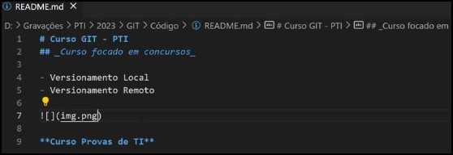

<!-- usa cerquilha para tamanho das letras -->
# Módulo (MD396): Git - Prof. Rodrigo Macedo
## exemplo uso Git
• fizemos versionamento local
• fizemos versionamento remoto
<!-- posso atribuir um arquivo jpg para mostrar -->

** fim arquivo **
